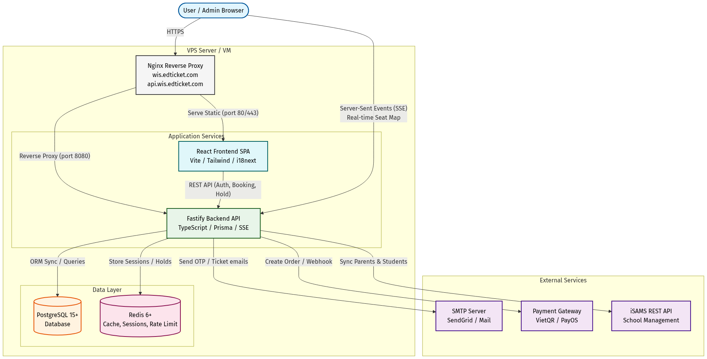

# 🎫 WIS Auditorium Booking

> Hệ thống đặt chỗ trực tuyến dành cho hội trường WIS — hỗ trợ real-time seat map, thanh toán tích hợp, check-in bằng QR code và quản trị toàn diện.


---

## 📑 Mục lục

- [Tổng quan](#-tổng-quan)
- [Tính năng chính](#-tính-năng-chính)
- [Kiến trúc hệ thống](#-kiến-trúc-hệ-thống)
- [Tech Stack](#-tech-stack)
- [Cấu trúc dự án](#-cấu-trúc-dự-án)
- [Cài đặt](#-cài-đặt)
- [Cấu hình](#-cấu-hình)
- [Chạy ứng dụng](#-chạy-ứng-dụng)
- [Deployment](#-deployment)
- [API Endpoints](#-api-endpoints)
- [Testing](#-testing)
- [Đa ngôn ngữ (i18n)](#-đa-ngôn-ngữ-i18n)
- [Contributing](#-contributing)
- [License](#-license)

---

## 🌟 Tổng quan

**WIS Auditorium Booking** là nền tảng đặt vé & quản lý chỗ ngồi cho các sự kiện tại hội trường WIS. Hệ thống cho phép người dùng chọn ghế trên sơ đồ real-time, thanh toán trực tuyến, nhận vé điện tử kèm QR code và check-in nhanh chóng tại sự kiện.

Dự án được thiết kế với kiến trúc **monorepo** gồm backend API và frontend SPA, triển khai trên một VPS duy nhất với Nginx reverse proxy.

---

## ✨ Tính năng chính

### 👤 Dành cho người dùng
- **Sơ đồ chỗ ngồi real-time** — cập nhật trạng thái ghế tức thời qua SSE (Server-Sent Events)
- **Quy trình đặt vé hoàn chỉnh** — Chọn ghế → Giữ chỗ tạm thời → Xác nhận → Thanh toán → Nhận vé
- **Vé điện tử với QR Code** — xuất vé dạng ảnh, quét QR để check-in
- **Xác thực OTP** qua email — không cần mật khẩu phức tạp
- **Quản lý vé cá nhân** — xem, hủy hoặc thay đổi booking
- **Đa ngôn ngữ** — hỗ trợ 5 ngôn ngữ: 🇬🇧 English, 🇻🇳 Tiếng Việt, 🇰🇷 한국어, 🇯🇵 日本語, 🇸🇦 العربية

### 🛡️ Dành cho quản trị viên
- **Bảng điều khiển Admin** — quản lý events, bookings, users, seats
- **Phân quyền RBAC** — Super Admin, Admin, Staff, Attendee, Parent, Guest
- **Import dữ liệu iSAMS** — đồng bộ thông tin học sinh & phụ huynh từ hệ thống quản lý trường học
- **Check-in scanner** — quét QR code để check-in tại sự kiện
- **Xuất dữ liệu** — export danh sách booking
- **Quản lý sơ đồ ghế** — tạo, chỉnh sửa, khóa/mở ghế theo hàng & cột
- **Cấu hình liên hệ** — tùy chỉnh thông tin hỗ trợ hiển thị cho người dùng

### 💳 Thanh toán
- **VietQR** — thanh toán qua mã QR ngân hàng (Host2Client model)
- **PayOS** — cổng thanh toán trực tuyến (tùy chọn)
- **Webhook xác nhận** — tự động cập nhật trạng thái thanh toán
- **Hỗ trợ sự kiện miễn phí & có phí**

---

## 🏗 Kiến trúc hệ thống



---

## 🛠 Tech Stack

| Layer          | Công nghệ                                                    |
|:---------------|:--------------------------------------------------------------|
| **Frontend**   | React 19, Vite 7, TypeScript, TailwindCSS, i18next, QR Code  |
| **Backend**    | Fastify 5, TypeScript, Prisma ORM, Zod validation            |
| **Database**   | PostgreSQL 15+                                                |
| **Cache**      | Redis                                                         |
| **Real-time**  | Server-Sent Events (SSE)                                      |
| **Auth**       | JWT + HttpOnly Cookie, OTP qua email, Refresh Token rotation  |
| **Email**      | Nodemailer + SendGrid                                         |
| **Payment**    | VietQR, PayOS (tùy chọn)                                     |
| **Process Mgr**| PM2                                                           |
| **Web Server** | Nginx                                                         |
| **Testing**    | Jest (BE), Vitest (FE), Playwright (E2E)                      |

---

## 📁 Cấu trúc dự án

```
WIS-auditorium/
├── wis-auditorium-booking-be/       # Backend API
│   ├── prisma/
│   │   └── schema.prisma            # Database schema
│   ├── src/
│   │   ├── routes/
│   │   │   ├── admin/               # Admin endpoints (RBAC protected)
│   │   │   ├── public/              # Public endpoints (auth, booking, hold, payment...)
│   │   │   ├── unified/             # Unified API endpoints
│   │   │   └── webhooks/            # Payment webhook handlers
│   │   ├── middleware/              # Auth guards, cookie auth
│   │   ├── services/               # Business logic services
│   │   ├── payment/                # Payment gateway integrations
│   │   ├── mail/                   # Email templates & sender
│   │   ├── otp/                    # OTP generation & verification
│   │   ├── hold/                   # Seat hold management
│   │   ├── scheduler/             # Cron jobs (cleanup, etc.)
│   │   └── utils/                  # Shared utilities
│   ├── .env.example                # Environment template
│   └── package.json
│
├── wis-auditorium-booking-fe/       # Frontend SPA
│   ├── components/
│   │   ├── AdminScreen.tsx          # Admin dashboard
│   │   ├── NewBookingScreen.tsx     # Seat selection & booking
│   │   ├── PaymentScreen.tsx        # Payment flow
│   │   ├── MyTicketsScreen.tsx      # User's tickets
│   │   ├── ConfirmationTicketScreen.tsx  # Ticket with QR code
│   │   └── ...
│   ├── hooks/                      # Custom React hooks
│   ├── i18n/                       # Internationalization config
│   ├── lib/                        # API client, utilities
│   ├── utils/                      # Shared utilities
│   ├── types.ts                    # TypeScript type definitions
│   ├── App.tsx                     # Main application
│   └── package.json
│
├── config/
│   ├── ecosystem.config.js          # PM2 configuration
│   └── logrotate.conf               # Log rotation config
│
├── scripts/                         # Deployment & dev scripts
│   ├── build-and-deploy.sh
│   ├── dev-start.sh
│   └── dev-stop.sh
│
└── deployment-package/              # Production build output
    ├── backend/
    ├── frontend/
    └── ecosystem.config.js
```

---

## 🚀 Cài đặt

### Yêu cầu hệ thống

- **Node.js** ≥ 18
- **PostgreSQL** ≥ 15
- **Redis** ≥ 6
- **npm** ≥ 9

### 1. Clone repository

```bash
git clone <repository-url>
cd WIS-auditorium
```

### 2. Cài đặt dependencies

```bash
# Backend
cd wis-auditorium-booking-be
npm install

# Frontend
cd ../wis-auditorium-booking-fe
npm install
```

### 3. Khởi tạo database

```bash
cd wis-auditorium-booking-be

# Tạo schema từ Prisma
npx prisma generate
npx prisma db push

# Seed dữ liệu admin mặc định
npm run seed
```

---

## ⚙️ Cấu hình

Copy file `.env.example` và cập nhật các giá trị cho môi trường của bạn:

```bash
# Backend
cp wis-auditorium-booking-be/.env.example wis-auditorium-booking-be/.env

# Frontend
cp wis-auditorium-booking-fe/.env.example wis-auditorium-booking-fe/.env
```

### Biến môi trường Backend chính

| Biến                | Mô tả                                  | Mặc định            |
|:--------------------|:----------------------------------------|:---------------------|
| `DATABASE_URL`      | PostgreSQL connection string            | —                    |
| `JWT_SECRET`        | Secret key cho JWT token                | —                    |
| `SESSION_TTL_MINUTES` | Thời gian session (phút)              | `60`                 |
| `HOLD_TTL_SECONDS`  | Thời gian giữ ghế tạm (giây)           | `300`                |
| `PORT`              | Port backend server                     | `8080`               |
| `REDIS_URL`         | Redis connection string                 | `redis://localhost:6379` |
| `CORS_ORIGIN`       | Allowed origins (dấu `,` ngăn cách)    | —                    |
| `SMTP_HOST`         | SMTP mail server                        | —                    |
| `SMTP_PORT`         | SMTP port                               | `587`                |
| `SMTP_USER`         | SMTP username                           | —                    |
| `SMTP_PASS`         | SMTP password                           | —                    |
| `VIETQR_MOCK`       | Chế độ mock VietQR                      | `true`               |
| `NODE_ENV`          | Môi trường (development / production)   | `development`        |

### Biến môi trường Frontend chính

| Biến              | Mô tả                  |
|:------------------|:------------------------|
| `VITE_API_URL`    | URL của Backend API      |

---

## 🖥 Chạy ứng dụng

### Development

```bash
# Sử dụng script có sẵn (khuyến nghị)
./scripts/dev-start.sh

# Hoặc chạy thủ công:

# Terminal 1 — Backend
cd wis-auditorium-booking-be
npm run dev

# Terminal 2 — Frontend
cd wis-auditorium-booking-fe
npm run dev
```

Dừng development:

```bash
./scripts/dev-stop.sh
```

### Production

```bash
# Build & deploy đầy đủ
./scripts/build-and-deploy.sh

# Hoặc dùng PM2
pm2 start config/ecosystem.config.js --env production
```

---

## 🚢 Deployment

Xem chi tiết tại [README-DEPLOYMENT.md](./README-DEPLOYMENT.md).

### Scripts có sẵn

| Script                          | Mục đích                                |
|:--------------------------------|:----------------------------------------|
| `./scripts/build-and-deploy.sh` | Build & deploy toàn bộ hệ thống         |
| `./scripts/dev-start.sh`        | Khởi chạy môi trường development        |
| `./scripts/dev-stop.sh`         | Dừng môi trường development             |

### Quy trình cập nhật production

```bash
# Pull code mới & tự động rebuild + restart
./update-and-restart.sh

# Chỉ restart frontend
./restart-frontend.sh

# Chỉ restart backend
./restart-backend.sh

# Rollback khẩn cấp
./rollback.sh
```

---

## 📡 API Endpoints

### Public (Người dùng)

| Method | Endpoint                      | Mô tả                          |
|:-------|:------------------------------|:--------------------------------|
| POST   | `/api/public/auth/login`      | Đăng nhập (email + OTP)        |
| POST   | `/api/public/otp/send`        | Gửi mã OTP qua email           |
| GET    | `/api/public/events`          | Danh sách sự kiện               |
| GET    | `/api/public/events/:id/seats`| Sơ đồ chỗ ngồi                 |
| POST   | `/api/public/hold`            | Giữ chỗ tạm thời               |
| DELETE | `/api/public/hold`            | Hủy giữ chỗ                    |
| POST   | `/api/public/booking`         | Xác nhận booking                |
| GET    | `/api/public/booking`         | Danh sách booking của user      |
| POST   | `/api/public/payments`        | Tạo thanh toán                  |
| GET    | `/api/public/stream/:eventId` | SSE stream cập nhật real-time   |

### Admin (Quản trị)

| Method | Endpoint                         | Mô tả                          |
|:-------|:---------------------------------|:--------------------------------|
| GET    | `/api/admin/events`              | Quản lý sự kiện                 |
| POST   | `/api/admin/events`              | Tạo sự kiện mới                 |
| PUT    | `/api/admin/events/:id`          | Cập nhật sự kiện                |
| GET    | `/api/admin/bookings`            | Quản lý bookings                |
| GET    | `/api/admin/users`               | Quản lý users                   |
| POST   | `/api/admin/seats`               | Quản lý chỗ ngồi               |
| POST   | `/api/admin/isams/sync`          | Đồng bộ dữ liệu iSAMS          |
| GET    | `/api/admin/export`              | Xuất dữ liệu                   |
| POST   | `/api/admin/upload`              | Upload banner image             |

### Webhook

| Method | Endpoint                    | Mô tả                              |
|:-------|:----------------------------|:------------------------------------|
| POST   | `/api/webhooks/vietqr`      | VietQR payment callback             |
| POST   | `/api/webhooks/payos`       | PayOS payment callback              |

---

## 🧪 Testing

### Backend

```bash
cd wis-auditorium-booking-be

npm test                # Chạy tất cả tests
npm run test:unit       # Chỉ unit tests
npm run test:integration # Chỉ integration tests
npm run test:coverage   # Với coverage report
```

### Frontend

```bash
cd wis-auditorium-booking-fe

npm test                # Chạy tất cả tests
npm run test:watch      # Watch mode
npm run test:coverage   # Với coverage report
npm run test:e2e        # Playwright E2E tests
```

---

## 🌐 Đa ngôn ngữ (i18n)

Hệ thống hỗ trợ 5 ngôn ngữ, được quản lý qua `i18next`:

| Ngôn ngữ        | Mã   |
|:-----------------|:-----|
| 🇬🇧 English     | `en` |
| 🇻🇳 Tiếng Việt  | `vi` |
| 🇰🇷 한국어       | `ko` |
| 🇯🇵 日本語       | `ja` |
| 🇸🇦 العربية     | `ar` |

Người dùng có thể chuyển đổi ngôn ngữ trực tiếp trên giao diện. File translation nằm tại `wis-auditorium-booking-fe/localization.ts`.

---

## 🗄 Database Schema

Các model chính trong hệ thống:

| Model           | Mô tả                                        |
|:----------------|:----------------------------------------------|
| `User`          | Người dùng (attendee, parent, admin, staff)   |
| `Event`         | Sự kiện (PUBLIC hoặc PARENT_ONLY)             |
| `Seat`          | Ghế ngồi (theo hàng & cột, gắn với event)    |
| `Booking`       | Đặt chỗ (trạng thái: HOLDING → BOOKED)       |
| `BookingSeat`   | Liên kết booking ↔ seat (many-to-many)        |
| `Session`       | Phiên đăng nhập                               |
| `RefreshSession`| Refresh token (rotation, device fingerprint)  |
| `Parent`        | Phụ huynh (import từ iSAMS)                   |
| `Student`       | Học sinh (import từ iSAMS)                    |
| `ParentStudent` | Liên kết phụ huynh ↔ học sinh                 |
| `AppSetting`    | Cấu hình ứng dụng (key-value)                 |

---

## 🤝 Contributing

1. Fork repository
2. Tạo feature branch: `git checkout -b feature/ten-tinh-nang`
3. Commit changes: `git commit -m 'feat: mô tả thay đổi'`
4. Push to branch: `git push origin feature/ten-tinh-nang`
5. Tạo Pull Request

---

## 📄 License

© WIS Auditorium Booking
